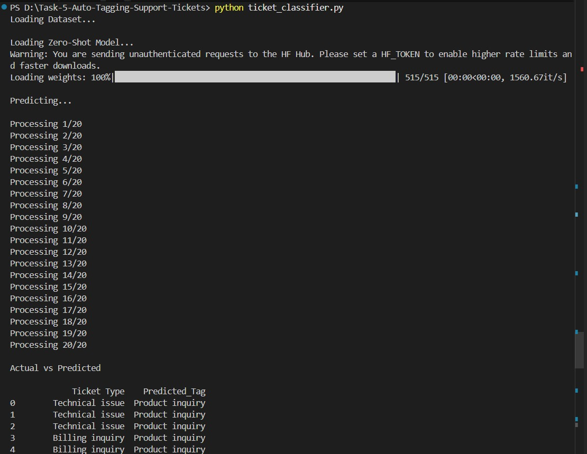
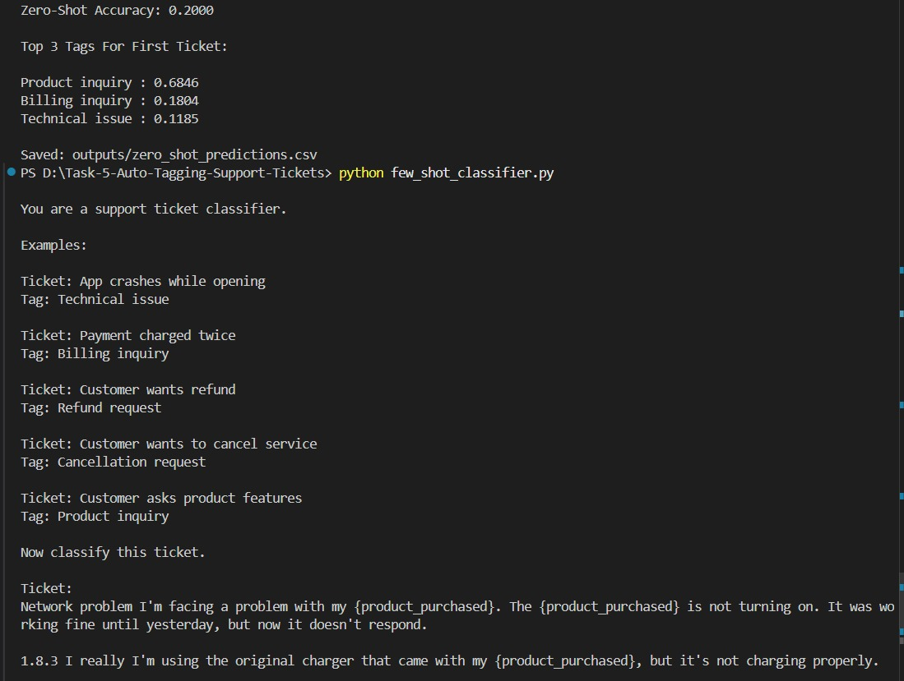
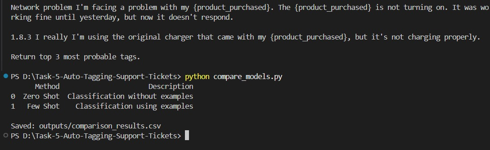

# 🧠 Auto Tagging Support Tickets Using LLM

## 📌 Project Overview

This project demonstrates an intelligent support ticket classification system powered by Large Language Models (LLMs). The goal is to automatically assign relevant categories to customer support tickets based on their subject and description.

---

### 🎯 Objectives

Automatically classify support tickets
Predict Top 3 probable tags
Compare Zero-Shot and Few-Shot approaches
Evaluate classification performance

---

### 📂 Dataset

Dataset: Customer Support Tickets Dataset

### Key Columns Used:

Ticket Type
Ticket Subject
Ticket Description

### Target Labels:

Technical issue
Billing inquiry
Cancellation request
Product inquiry
Refund request

---

## 🛠 Technologies Used

### Programming Language

* Python

### Libraries

* Pandas
* NumPy
* Scikit-Learn
* Transformers
* PyTorch
* Jupyter Notebook

### Model

* Facebook BART Large MNLI

### Development Environment

* VS Code
* Jupyter Notebook

---

## 📁 Project Structure

```text
Task-5-Auto-Tagging-Support-Tickets
│
├── data
│   └── customer_support_tickets.csv
│
├── outputs
│   ├── zero_shot_predictions.csv
│   └── comparison_results.csv
│
├── screenshots
│   ├── dataset_preview.png
│   ├── shots_output.png
│   ├── top3_tags_output.png
│   
├── ticket_classifier.py
├── few_shot_classifier.py
├── compare_models.py
├── app.py
├── requirements.txt
├── Task_5_Auto_Tagging_Support_Tickets.ipynb
└── README.md
```

---


### Install Dependencies

```bash
pip install -r requirements.txt
```

## ▶ Running the Project

 1. Run Zero-Shot Classification
 2. Run Few-Shot Prompting
 3. Compare Methods
 4. Interactive Demo


## 📸 Screenshots

### Dataset Preview



### Shots Classification Output



### Top 3 Predicted Tags



---

## 👩‍💻 Author

**Areeba Sardar**
---

