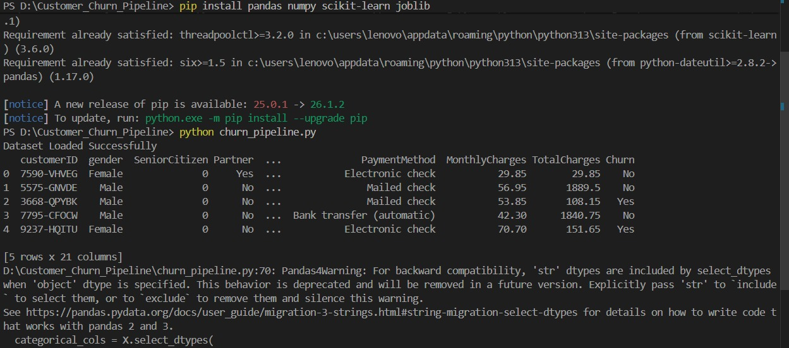
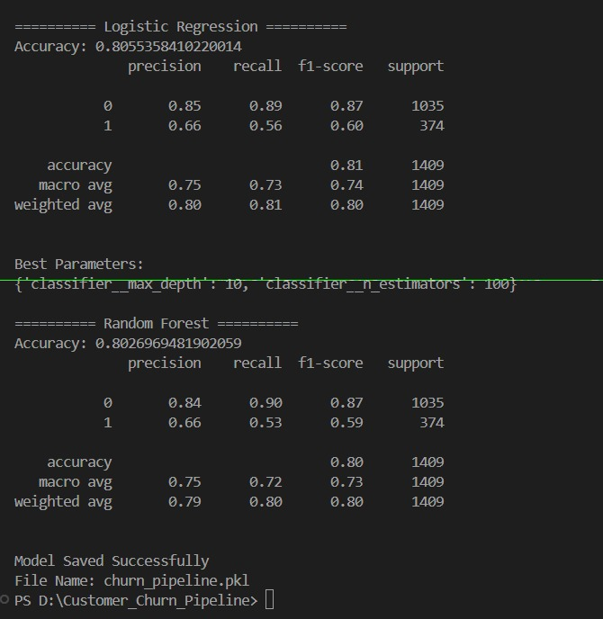

# Customer Churn Prediction Using Scikit-learn Pipeline API

## Project Overview

This project implements an end-to-end machine learning pipeline for customer churn prediction using the Telco Customer Churn Dataset.

The pipeline performs:

* Data preprocessing
* Feature scaling
* Categorical encoding
* Model training
* Hyperparameter tuning
* Model evaluation
* Pipeline export using Joblib

---

## Dataset

Telco Customer Churn Dataset

Target Variable:

* Churn (Yes/No)

---

## Technologies Used

* Python
* Pandas
* NumPy
* Scikit-learn
* Joblib

---

## Machine Learning Workflow

1. Load Dataset
2. Data Cleaning
3. Feature Selection
4. Train-Test Split
5. Preprocessing using Pipeline API
6. Logistic Regression Training
7. Random Forest Training
8. Hyperparameter Tuning using GridSearchCV
9. Model Evaluation
10. Pipeline Export

---

## Results

### Logistic Regression

Accuracy: 80.55%

### Random Forest

Accuracy: 80.27%

Best Parameters:

* max_depth = 10
* n_estimators = 100

---

## Project Screenshots

### Dataset Preview



### Dataset Information



---

## Output Files

### Trained Pipeline

```text
churn_pipeline.pkl
```

### Source Code

```text
churn_pipeline.py
```

### Notebook

```text
churn_pipeline.ipynb
```

---

## Author

Areeba Sardar
