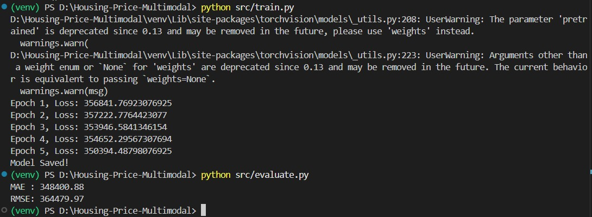
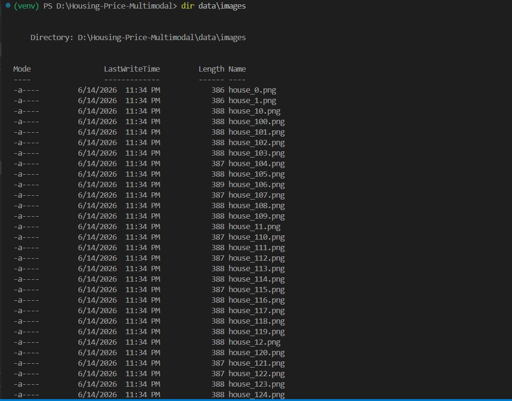

# 🏠 Multimodal Housing Price Prediction

## 📌 Overview

This project demonstrates a **Multimodal Machine Learning** approach for predicting house prices using both:

* 🖼️ House Images
* 📊 Tabular Data (Area, Bedrooms, Bathrooms, Garage)

The model combines image features extracted using a CNN with tabular features processed through a neural network to predict house prices.

---

## 🎯 Objective

Build a deep learning model that uses both image and structured data for house price prediction through feature fusion.

---

## 📁 Project Structure

```text
Housing-Price-Multimodal/
│
├── data/
├── notebooks/
├── screenshots/
├── src/
├── model.pth
├── requirements.txt
└── README.md
```

---

## 📊 Dataset

The synthetic dataset contains:

* 200 house images
* Housing attributes:

  * Area
  * Bedrooms
  * Bathrooms
  * Garage
* House Price (Target)

---

## 🏗️ Model Architecture

* **ResNet18 CNN** → Image feature extraction
* **MLP** → Tabular feature processing
* **Feature Fusion** → Combines both feature sets
* **Regression Layer** → Predicts house price

---

## 🛠️ Technologies Used

* Python
* PyTorch
* Torchvision
* Pandas
* NumPy
* Scikit-learn
* Pillow

---

## 🚀 How to Run

### Install Dependencies

```bash
pip install -r requirements.txt
```

### Generate Dataset

```bash
python src/generate_dataset.py
```

### Train Model

```bash
python src/train.py
```

### Evaluate Model

```bash
python src/evaluate.py
```

---

## 📈 Results

| Metric | Value     |
| ------ | --------- |
| MAE    | 348400.88 |
| RMSE   | 364479.97 |

> Results are based on a synthetic dataset and are intended to demonstrate the multimodal architecture.

---

## 📸 Screenshots

Add the following screenshots in the `screenshots/` folder:

* Dataset generation output



* Evaluation results



---

## 📌 Key Features

* Multimodal Deep Learning
* CNN-based Image Processing
* Tabular Data Processing
* Feature Fusion
* Regression-based Prediction
* End-to-End Pipeline

---

## 👩‍💻 Author

**Areeba Sardar**

---

## ⭐ Acknowledgement

Developed as part of an AI/ML Internship Task focusing on Multimodal Machine Learning.

