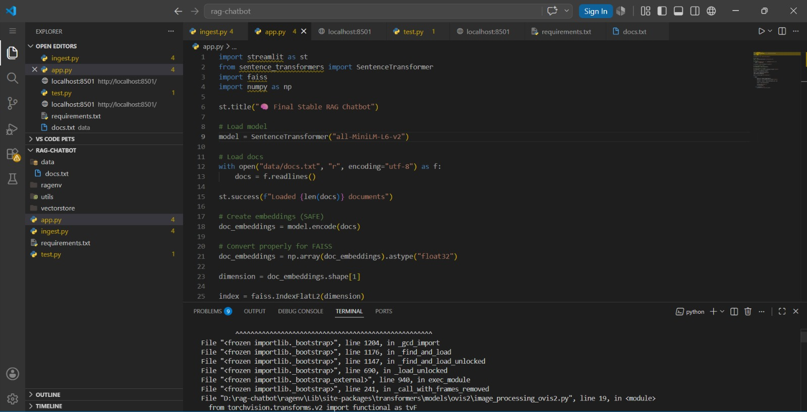
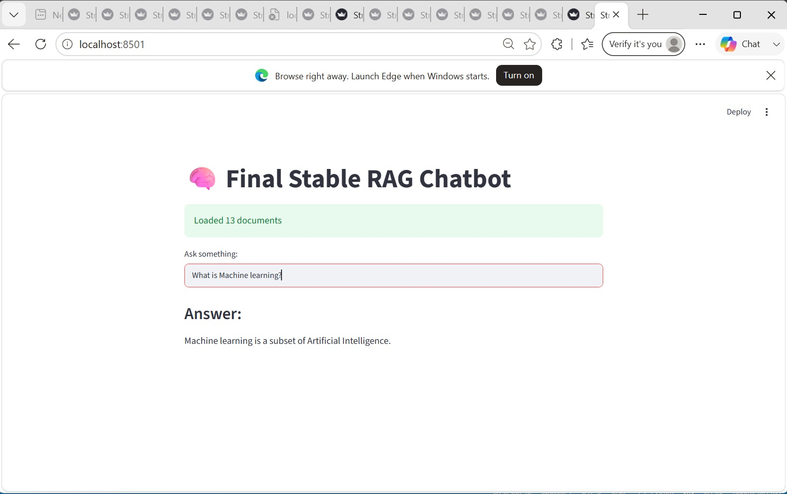

# 🧠 RAG Chatbot Using FAISS & Sentence Transformers

## 📌 Project Overview

This project implements a **Retrieval-Augmented Generation (RAG) Chatbot** that answers user queries by retrieving relevant information from a custom knowledge base using semantic search.

The system uses Sentence Transformers for embedding generation, FAISS for vector search, and Streamlit for the user interface.

---

## 🛠️ Technologies Used

- Python
- Streamlit
- LangChain
- FAISS
- Sentence Transformers
- NumPy

---

## ⚙️ Workflow

1. Load documents from `docs.txt`
2. Split text into chunks
3. Generate embeddings
4. Store embeddings in FAISS
5. Process user queries
6. Retrieve relevant documents
7. Display answers through Streamlit

---

## 📁 Project Structure

```text
rag-chatbot/
│
├── app.py
├── ingest.py
├── docs.txt
├── vectorstore/
├── screenshots/
├── requirements.txt
├── README.md
└── rag_chatbot.ipynb
```

---

## 🚀 Installation

```bash
py -3.11 -m venv ragenv
ragenv\Scripts\activate

pip install -r requirements.txt
```

---

## ▶️ Run Project

### Create Vector Database

```bash
python ingest.py
```

### Start Streamlit App

```bash
streamlit run app.py
```

---

## 💬 Example

**Query:**

```text
What is Artificial Intelligence?
```

**Response:**

```text
Machine learning is a subset of Artificial Intelligence.
```

---

## 📸 Screenshots

### Data Preview



### User Query & Response



---

## 📊 Results

- Semantic document retrieval implemented
- FAISS vector database created successfully
- Streamlit chatbot interface developed
- Accurate retrieval-based responses generated

---

## 👨‍💻 Author

**Areeba Sardar**  
AI / ML Internship Project